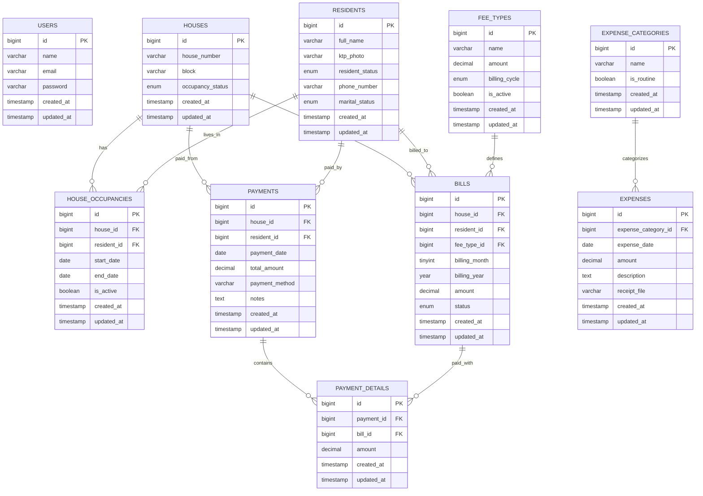

# Product Requirements Document (PRD)
## Aplikasi Administrasi Iuran dan Pengeluaran RT

**Nama Produk:** RT Finance & Resident Management
**Versi Dokumen:** 1.1
**Tanggal:** 03 Juli 2026
**Platform:** Web Application
**Backend:** Laravel
**Frontend:** React
**Database:** MySQL
**Deployment:** Local Environment / Non-Docker

---

## 1. Ringkasan Produk

Aplikasi Administrasi Iuran dan Pengeluaran RT adalah aplikasi web untuk membantu Ketua RT mengelola data penghuni, data rumah, pembayaran iuran bulanan, pengeluaran lingkungan, serta laporan keuangan perumahan.

Aplikasi ini dibuat untuk kasus perumahan dengan total 20 rumah. Sebanyak 15 rumah dihuni tetap, sedangkan 5 rumah lainnya dapat kosong atau dihuni sementara/kontrak pada periode tertentu. Iuran bulanan terdiri dari iuran satpam sebesar Rp100.000 dan iuran kebersihan sebesar Rp15.000.

---

## 2. Latar Belakang

Pengelolaan administrasi RT secara manual berisiko menyebabkan data tidak rapi, riwayat penghuni sulit dilacak, status pembayaran tidak transparan, dan laporan pemasukan/pengeluaran sulit dibuat.

Ketua RT membutuhkan sistem yang dapat:
- Mencatat data penghuni.
- Mencatat data rumah dan status hunian.
- Menyimpan riwayat penghuni pada setiap rumah.
- Mengelola pembayaran iuran bulanan.
- Mengelola pengeluaran rutin maupun non-rutin.
- Menampilkan laporan keuangan bulanan dan tahunan.

---

## 3. Tujuan Produk

Tujuan utama aplikasi ini adalah menyediakan sistem administrasi RT yang mudah digunakan, terstruktur, dan mampu menghasilkan laporan keuangan yang jelas.

Secara khusus, aplikasi harus dapat:
1. Mengelola data penghuni.
2. Mengelola data rumah.
3. Mengelola relasi penghuni dengan rumah.
4. Mencatat riwayat penghuni per rumah.
5. Mencatat pembayaran iuran satpam dan kebersihan.
6. Mencatat pengeluaran bulanan maupun insidental.
7. Menampilkan laporan summary pemasukan, pengeluaran, dan saldo.
8. Menampilkan grafik laporan selama 1 tahun.
9. Menampilkan detail pemasukan dan pengeluaran pada bulan tertentu.

---

## 4. Ruang Lingkup Produk

### 4.1 In Scope

Fitur yang termasuk dalam ruang lingkup aplikasi:

- Authentication pengguna admin/RT.
- CRUD data penghuni.
- Upload foto KTP penghuni.
- CRUD data rumah.
- Pengaturan penghuni aktif pada rumah.
- Riwayat penghuni pada setiap rumah.
- Status rumah: dihuni atau tidak dihuni.
- Pencatatan pembayaran iuran bulanan.
- Pencatatan pembayaran lebih dari 1 bulan, termasuk pembayaran 1 tahun.
- Pencatatan pengeluaran.
- Laporan summary bulanan.
- Laporan detail bulanan.
- Grafik pemasukan, pengeluaran, dan saldo selama 1 tahun.
- REST API Laravel.
- Frontend React terpisah dari backend.
- Seluruh komponen UI frontend wajib menggunakan shadcn/ui.
- Dashboard modern, informatif, dan bergaya seperti dashboard Cloudflare.
- Penyajian data wajib menggunakan chart batang, garis, atau lingkaran sesuai konteks data.
- Daftar data wajib menggunakan table.
- Proses tambah, ubah, dan hapus data wajib menggunakan dialog/modal.
- Upload gambar wajib memiliki preview sebelum disimpan.
- Database MySQL.
- Panduan instalasi tanpa Docker.

---

## 5. Target Pengguna

### 5.1 Admin / Ketua RT

Pengguna utama aplikasi. Bertanggung jawab untuk:
- Mengelola data penghuni.
- Mengelola data rumah.
- Mencatat pembayaran.
- Mencatat pengeluaran.
- Melihat laporan keuangan.

### 5.2 Bendahara RT

Opsional pada pengembangan berikutnya. Dapat membantu:
- Mencatat pembayaran.
- Mencatat pengeluaran.
- Mengecek laporan.

---

## 6. Definisi Istilah

| Istilah | Definisi |
|---|---|
| Penghuni Tetap | Penghuni yang tinggal secara permanen dan wajib ditagih setiap bulan. |
| Penghuni Kontrak | Penghuni sementara pada rumah tertentu selama periode tertentu. |
| Rumah Dihuni | Rumah yang memiliki penghuni aktif. |
| Rumah Tidak Dihuni | Rumah kosong dan tidak memiliki penghuni aktif. |
| Iuran Satpam | Iuran bulanan sebesar Rp100.000. |
| Iuran Kebersihan | Iuran bulanan sebesar Rp15.000. |
| Pembayaran Lunas | Status pembayaran ketika semua tagihan periode terkait sudah dibayar. |
| Pembayaran Belum Lunas | Status pembayaran ketika tagihan belum dibayar atau belum lengkap. |
| Saldo | Total pemasukan dikurangi total pengeluaran. |

---

## 7. Asumsi dan Ketentuan

1. Total rumah awal adalah 20 rumah.
2. Sebanyak 15 rumah dihuni tetap.
3. Sebanyak 5 rumah dapat kosong atau dihuni kontrak/sementara.
4. Penghuni tetap ditagih setiap bulan.
5. Rumah kosong tidak ditagih.
6. Rumah kontrak/sementara hanya ditagih jika sedang memiliki penghuni aktif.
7. Iuran satpam default adalah Rp100.000 per bulan.
8. Iuran kebersihan default adalah Rp15.000 per bulan.
9. Pembayaran dapat dilakukan untuk satu bulan atau beberapa bulan sekaligus.
10. Pengeluaran dapat bersifat rutin atau non-rutin.
11. Backend dan frontend dibuat sebagai project terpisah.
12. Aplikasi tidak menggunakan Docker.

---

## 8. User Stories

### 8.1 Pengelolaan Penghuni

| ID | User Story | Acceptance Criteria |
|---|---|---|
| US-001 | Sebagai Admin, saya ingin menambahkan data penghuni agar data warga dapat tercatat. | Admin dapat mengisi nama lengkap, foto KTP, status penghuni, nomor telepon, dan status pernikahan. |
| US-002 | Sebagai Admin, saya ingin mengubah data penghuni agar data tetap akurat. | Admin dapat mengubah seluruh atribut penghuni. |
| US-003 | Sebagai Admin, saya ingin melihat daftar penghuni agar mudah mencari data warga. | Sistem menampilkan daftar penghuni dengan fitur pencarian dan filter status. |
| US-004 | Sebagai Admin, saya ingin melihat detail penghuni agar mengetahui informasi lengkapnya. | Sistem menampilkan data lengkap penghuni dan rumah yang sedang ditempati. |

### 8.2 Pengelolaan Rumah

| ID | User Story | Acceptance Criteria |
|---|---|---|
| US-005 | Sebagai Admin, saya ingin menambahkan rumah agar seluruh rumah di perumahan tercatat. | Admin dapat menambahkan nomor/nama rumah dan status rumah. |
| US-006 | Sebagai Admin, saya ingin mengubah data rumah agar informasi rumah tetap benar. | Admin dapat mengubah nomor/nama rumah dan status rumah. |
| US-007 | Sebagai Admin, saya ingin menetapkan penghuni pada rumah agar diketahui siapa penghuni aktifnya. | Sistem dapat menyimpan penghuni aktif pada rumah tertentu. |
| US-008 | Sebagai Admin, saya ingin melihat riwayat penghuni rumah agar perubahan penghuni terdokumentasi. | Sistem menampilkan daftar penghuni sebelumnya beserta periode tinggal. |
| US-009 | Sebagai Admin, saya ingin mengetahui status rumah dihuni/tidak dihuni agar penagihan sesuai kondisi rumah. | Sistem menampilkan status rumah dan penghuni aktif jika ada. |

### 8.3 Pengelolaan Pembayaran

| ID | User Story | Acceptance Criteria |
|---|---|---|
| US-010 | Sebagai Admin, saya ingin mencatat pembayaran iuran agar status pembayaran warga terdokumentasi. | Admin dapat memilih penghuni, rumah, jenis iuran, periode, dan nominal pembayaran. |
| US-011 | Sebagai Admin, saya ingin mencatat pembayaran lebih dari 1 bulan agar pembayaran tahunan dapat diproses. | Sistem mendukung pembayaran multi-periode. |
| US-012 | Sebagai Admin, saya ingin melihat status lunas/belum lunas agar mudah melakukan penagihan. | Sistem menampilkan status pembayaran per rumah dan per periode. |
| US-013 | Sebagai Admin, saya ingin melihat riwayat pembayaran rumah agar histori pembayaran terdokumentasi. | Sistem menampilkan daftar pembayaran beserta penghuni yang membayar dan statusnya. |

### 8.4 Pengelolaan Pengeluaran

| ID | User Story | Acceptance Criteria |
|---|---|---|
| US-014 | Sebagai Admin, saya ingin mencatat pengeluaran rutin agar biaya bulanan dapat dihitung. | Admin dapat mencatat kategori, tanggal, nominal, dan keterangan pengeluaran. |
| US-015 | Sebagai Admin, saya ingin mencatat pengeluaran non-rutin agar biaya insidental terdokumentasi. | Sistem dapat menyimpan pengeluaran seperti perbaikan jalan dan perbaikan selokan. |
| US-016 | Sebagai Admin, saya ingin melihat daftar pengeluaran agar mudah mengecek biaya lingkungan. | Sistem menampilkan daftar pengeluaran dengan filter bulan dan kategori. |

### 8.5 Laporan

| ID | User Story | Acceptance Criteria |
|---|---|---|
| US-017 | Sebagai Admin, saya ingin melihat summary pemasukan dan pengeluaran per bulan agar mengetahui kondisi kas. | Sistem menampilkan total pemasukan, total pengeluaran, dan saldo bulan tertentu. |
| US-018 | Sebagai Admin, saya ingin melihat grafik laporan selama 1 tahun agar tren keuangan mudah dipahami. | Sistem menampilkan grafik pemasukan, pengeluaran, dan saldo selama 12 bulan. |
| US-019 | Sebagai Admin, saya ingin melihat detail laporan bulan tertentu agar transaksi dapat diaudit. | Sistem menampilkan detail pemasukan dan pengeluaran pada bulan yang dipilih. |

---

## 9. Kebutuhan Fungsional

### 9.1 Authentication

#### FR-001 Login Admin
Sistem harus menyediakan halaman login untuk admin.

**Input:**
- Email
- Password

**Output:**
- Token/session login.
- Redirect ke dashboard jika berhasil.
- Pesan error jika gagal.

#### FR-002 Logout Admin
Sistem harus menyediakan fitur logout.

---

### 9.2 Modul Dashboard

#### FR-003 Dashboard Summary
Sistem harus menampilkan dashboard modern, informatif, dan bergaya seperti dashboard Cloudflare.

Dashboard wajib menggunakan komponen shadcn/ui untuk seluruh elemen UI dan menampilkan ringkasan:
- Total rumah.
- Total rumah dihuni.
- Total rumah tidak dihuni.
- Total penghuni tetap.
- Total penghuni kontrak.
- Total pemasukan bulan berjalan.
- Total pengeluaran bulan berjalan.
- Saldo bulan berjalan.
- Jumlah pembayaran belum lunas.

Ketentuan visual dashboard:
- Ringkasan angka ditampilkan menggunakan `Card` shadcn/ui.
- Tren pemasukan, pengeluaran, dan saldo 12 bulan ditampilkan menggunakan line chart.
- Komposisi status rumah ditampilkan menggunakan pie/donut chart.
- Perbandingan pemasukan dan pengeluaran bulanan ditampilkan menggunakan bar chart.
- Daftar pembayaran belum lunas ditampilkan menggunakan `Table` shadcn/ui.
- Filter periode menggunakan komponen shadcn/ui seperti `Select`, `Popover`, dan `Calendar` bila diperlukan.

---

### 9.3 Modul Penghuni

#### FR-004 Tambah Penghuni
Sistem harus dapat menambahkan penghuni baru.

**Field wajib:**
- Nama lengkap.
- Foto KTP.
- Status penghuni: `tetap` atau `kontrak`.
- Nomor telepon.
- Status pernikahan: `menikah` atau `belum_menikah`.

#### FR-005 Ubah Penghuni
Sistem harus dapat mengubah data penghuni.

#### FR-006 Daftar Penghuni
Sistem harus menampilkan daftar penghuni.

**Filter:**
- Status penghuni.
- Status pernikahan.
- Keyword nama atau nomor telepon.

#### FR-007 Detail Penghuni
Sistem harus menampilkan detail penghuni dan riwayat rumah yang pernah ditempati.

#### FR-008 Upload Foto KTP
Sistem harus menyimpan file foto KTP.

**Ketentuan UI:**
- Form upload wajib menggunakan komponen shadcn/ui.
- Setelah user memilih file, sistem wajib menampilkan preview gambar sebelum disimpan.
- Preview gambar wajib dapat diganti jika user memilih file lain.
- Jika file tidak valid, sistem menampilkan pesan validasi menggunakan komponen feedback shadcn/ui.

**Validasi:**
- Format: JPG, JPEG, PNG, atau WEBP.
- Ukuran maksimal disarankan: 2 MB.

---

### 9.4 Modul Rumah

#### FR-009 Tambah Rumah
Sistem harus dapat menambahkan rumah.

**Field:**
- Nomor/nama rumah.
- Alamat/blok opsional.
- Status rumah: `dihuni` atau `tidak_dihuni`.

#### FR-010 Ubah Rumah
Sistem harus dapat mengubah data rumah.

#### FR-011 Tetapkan Penghuni Rumah
Sistem harus dapat menetapkan penghuni aktif pada rumah.

**Field:**
- Rumah.
- Penghuni.
- Tanggal mulai tinggal.
- Tanggal selesai tinggal, opsional.
- Status penghuni saat tinggal.

#### FR-012 Akhiri Masa Tinggal Penghuni
Sistem harus dapat mengakhiri masa tinggal penghuni pada rumah.

**Dampak sistem:**
- Data penghuni rumah aktif menjadi tidak aktif.
- Tanggal selesai tinggal terisi.
- Status rumah berubah menjadi `tidak_dihuni` jika tidak ada penghuni aktif lain.

#### FR-013 Riwayat Penghuni Rumah
Sistem harus menampilkan riwayat penghuni pada masing-masing rumah.

#### FR-014 Riwayat Pembayaran Rumah
Sistem harus menampilkan riwayat pembayaran rumah beserta:
- Periode pembayaran.
- Nama penghuni pembayar.
- Jenis iuran.
- Nominal.
- Status lunas/belum lunas.

---

### 9.5 Modul Iuran

#### FR-015 Master Jenis Iuran
Sistem harus memiliki master jenis iuran:
1. Satpam: Rp100.000.
2. Kebersihan: Rp15.000.

#### FR-016 Ubah Nominal Iuran
Sistem sebaiknya dapat mengubah nominal iuran agar fleksibel jika kebijakan RT berubah.

#### FR-017 Generate Tagihan Bulanan
Sistem harus dapat membuat tagihan bulanan untuk rumah yang wajib ditagih.

**Ketentuan tagihan:**
- Penghuni tetap ditagih setiap bulan.
- Rumah kontrak ditagih jika memiliki penghuni aktif.
- Rumah kosong tidak ditagih.
- Jenis tagihan terdiri dari satpam dan kebersihan.

#### FR-018 Status Tagihan
Sistem harus dapat menampilkan status tagihan:
- `belum_lunas`
- `lunas`
- `sebagian` jika pembayaran parsial diterapkan.

---

### 9.6 Modul Pembayaran

#### FR-019 Tambah Pembayaran
Sistem harus dapat mencatat pembayaran iuran bulanan.

**Field:**
- Rumah.
- Penghuni.
- Tanggal pembayaran.
- Jenis iuran.
- Periode bulan.
- Periode tahun.
- Jumlah bulan dibayar.
- Nominal pembayaran.
- Metode pembayaran, opsional.
- Catatan, opsional.

#### FR-020 Pembayaran Multi-Bulan
Sistem harus mendukung pembayaran untuk beberapa bulan sekaligus, misalnya pembayaran iuran kebersihan untuk 1 tahun.

#### FR-021 Validasi Pembayaran
Sistem harus memvalidasi:
- Penghuni harus aktif pada rumah untuk periode tagihan.
- Nominal pembayaran tidak boleh negatif.
- Periode pembayaran tidak boleh kosong.
- Tagihan yang sudah lunas tidak boleh dibayar ulang tanpa proses koreksi.

#### FR-022 Update Status Tagihan
Setelah pembayaran dicatat, sistem harus memperbarui status tagihan menjadi lunas atau sebagian sesuai nominal pembayaran.

---

### 9.7 Modul Pengeluaran

#### FR-023 Tambah Pengeluaran
Sistem harus dapat mencatat pengeluaran.

**Field:**
- Tanggal pengeluaran.
- Kategori pengeluaran.
- Nominal.
- Keterangan.
- Bukti pengeluaran, opsional.

**Ketentuan UI:**
- Form tambah pengeluaran wajib ditampilkan dalam dialog/modal shadcn/ui.
- Upload bukti pengeluaran wajib memiliki preview gambar sebelum disimpan jika file berupa gambar.

#### FR-024 Ubah Pengeluaran
Sistem harus dapat mengubah data pengeluaran.

#### FR-025 Kategori Pengeluaran
Sistem harus menyediakan kategori pengeluaran, misalnya:
- Gaji satpam.
- Token listrik pos satpam.
- Perbaikan jalan.
- Perbaikan selokan.
- Kebersihan.
- Lainnya.

#### FR-026 Pengeluaran Rutin dan Non-Rutin
Sistem harus dapat membedakan pengeluaran rutin dan non-rutin.

---

### 9.8 Modul Laporan

#### FR-027 Summary Bulanan
Sistem harus menampilkan summary keuangan per bulan:
- Total pemasukan.
- Total pengeluaran.
- Saldo bulan tersebut.
- Saldo akumulatif.

#### FR-028 Grafik Tahunan
Sistem harus menampilkan grafik selama 1 tahun:
- Pemasukan per bulan.
- Pengeluaran per bulan.
- Saldo per bulan.

#### FR-029 Detail Laporan Bulanan
Sistem harus menampilkan detail transaksi bulan tertentu:
- Daftar pemasukan dari pembayaran iuran.
- Daftar pengeluaran.
- Total pemasukan.
- Total pengeluaran.
- Saldo.

#### FR-030 Export Laporan
Opsional: sistem dapat mengekspor laporan ke PDF atau Excel.

---

## 10. Kebutuhan Non-Fungsional

### 10.1 Performance

- Halaman dashboard harus dapat dimuat maksimal 3 detik pada data awal 20 rumah.
- API list data harus mendukung pagination.
- Query laporan harus dioptimalkan menggunakan index database.

### 10.2 Security

- Password harus di-hash.
- Endpoint API harus dilindungi authentication.
- File foto KTP tidak boleh dapat diakses tanpa otorisasi.
- Validasi input dilakukan di backend.
- Sistem harus memiliki proteksi terhadap SQL Injection, XSS, dan CSRF sesuai standar Laravel.

### 10.3 Usability

- UI harus sederhana dan mudah digunakan oleh admin RT.
- Form wajib memiliki pesan validasi.
- Status pembayaran harus mudah dibedakan.
- Laporan harus dapat difilter berdasarkan bulan dan tahun.

### 10.4 Reliability

- Data pembayaran dan pengeluaran tidak boleh hilang.
- Transaksi pembayaran harus menggunakan database transaction.
- Sistem harus memiliki migration dan seeder untuk setup awal.

### 10.5 Maintainability

- Backend dan frontend dibuat terpisah.
- Struktur kode harus rapi dan modular.
- API harus terdokumentasi.
- Environment variable harus digunakan untuk konfigurasi database dan storage.

### 10.6 UI/UX dan Design System

- Tampilan aplikasi harus menggunakan gaya dashboard modern, bersih, informatif, dan profesional.
- Gaya desain mengacu pada pengalaman dashboard Cloudflare: layout ringkas, navigasi sidebar yang jelas, card statistik yang padat informasi, banyak whitespace, hierarchy visual kuat, dan tampilan data yang mudah dipindai.
- Seluruh komponen UI frontend wajib menggunakan **shadcn/ui**. Tidak diperbolehkan membuat komponen visual utama dari nol jika komponen tersebut sudah tersedia di shadcn/ui.
- Styling wajib konsisten menggunakan Tailwind CSS token/class yang kompatibel dengan shadcn/ui.
- Komponen form wajib menggunakan pola shadcn/ui, seperti `Form`, `Input`, `Label`, `Select`, `Textarea`, `Checkbox`, `Radio Group`, `Button`, dan komponen pendukung lain yang relevan.
- Komponen navigasi wajib menggunakan komponen shadcn/ui atau komposisi komponen shadcn/ui, seperti `Sidebar`, `Breadcrumb`, `Tabs`, `Dropdown Menu`, dan `Command` jika diperlukan.
- Komponen feedback wajib menggunakan shadcn/ui, seperti `Alert`, `Toast/Sonner`, `Badge`, `Skeleton`, dan `Progress`.
- Semua daftar data wajib ditampilkan menggunakan `Table` shadcn/ui, dilengkapi pagination, search, filter, sorting jika relevan, dan empty state.
- Semua aksi CRUD wajib dilakukan melalui `Dialog` atau `Alert Dialog` shadcn/ui:
  - Tambah data menggunakan dialog/modal form.
  - Ubah data menggunakan dialog/modal form.
  - Hapus data menggunakan alert dialog konfirmasi.
  - Detail data dapat menggunakan dialog/modal atau halaman detail sesuai kompleksitas data.
- Upload gambar, termasuk foto KTP dan bukti pengeluaran, wajib memiliki preview gambar sebelum data disimpan.
- Preview gambar wajib menggunakan komponen shadcn/ui sebagai container, misalnya `Card`, `Dialog`, atau `Aspect Ratio`.
- Tampilan harus responsive untuk desktop, tablet, dan mobile.
- Dashboard harus tetap nyaman digunakan pada data awal 20 rumah, namun struktur UI harus siap untuk jumlah data yang lebih besar.

### 10.7 Standar Penyajian Data

- Data numerik, tren, komposisi, dan perbandingan wajib disajikan menggunakan chart.
- Jenis chart yang diperbolehkan:
  - **Bar chart** untuk perbandingan kategori, contoh: rumah dihuni vs tidak dihuni, pemasukan per jenis iuran, pengeluaran per kategori.
  - **Line chart** untuk tren waktu, contoh: pemasukan, pengeluaran, dan saldo selama 12 bulan.
  - **Pie/donut chart** untuk komposisi, contoh: persentase status pembayaran atau komposisi jenis pengeluaran.
- Chart wajib menggunakan komponen chart yang kompatibel dengan shadcn/ui, misalnya pola `ChartContainer`, `ChartTooltip`, dan `ChartLegend` dari shadcn/ui dengan Recharts.
- Data list, histori, dan transaksi wajib disajikan menggunakan table, bukan card list biasa.
- Table wajib digunakan untuk:
  - Daftar penghuni.
  - Daftar rumah.
  - Daftar tagihan.
  - Daftar pembayaran.
  - Riwayat pembayaran.
  - Riwayat penghuni rumah.
  - Daftar pengeluaran.
  - Detail laporan bulanan.
- Table wajib memiliki state:
  - Loading state.
  - Empty state.
  - Error state.
  - Pagination jika data banyak.
- Dashboard boleh menggunakan card statistik, tetapi card hanya digunakan untuk ringkasan angka. Data detail tetap wajib menggunakan table dan data visual tetap wajib menggunakan chart.

---

## 11. Role dan Permission

### 11.1 Admin

Permission:
- Login dan logout.
- Mengelola penghuni.
- Mengelola rumah.
- Mengelola pembayaran.
- Mengelola pengeluaran.
- Melihat laporan.
- Mengubah master iuran.

### 11.2 Bendahara

Opsional untuk versi berikutnya.

Permission:
- Mengelola pembayaran.
- Mengelola pengeluaran.
- Melihat laporan.

---

## 12. Struktur Menu

1. Login
2. Dashboard
3. Penghuni
   - Daftar Penghuni
   - Tambah Penghuni
   - Detail Penghuni
4. Rumah
   - Daftar Rumah
   - Tambah Rumah
   - Detail Rumah
   - Riwayat Penghuni
   - Riwayat Pembayaran
5. Tagihan
   - Generate Tagihan
   - Daftar Tagihan
6. Pembayaran
   - Tambah Pembayaran
   - Riwayat Pembayaran
7. Pengeluaran
   - Tambah Pengeluaran
   - Daftar Pengeluaran
8. Laporan
   - Summary Bulanan
   - Grafik Tahunan
   - Detail Bulanan
9. Pengaturan
   - Master Iuran
   - Kategori Pengeluaran
10. Logout

### 12.1 Standar Layout dan Komponen shadcn/ui

Seluruh halaman frontend wajib menggunakan komponen shadcn/ui. Implementasi layout dan komponen direkomendasikan sebagai berikut:

| Area/Fitur | Komponen shadcn/ui Wajib |
|---|---|
| Layout utama | `Sidebar`, `Breadcrumb`, `Separator`, `Scroll Area` |
| Ringkasan dashboard | `Card`, `Badge`, `Tooltip`, `Skeleton` |
| Grafik dashboard/laporan | `ChartContainer`, `ChartTooltip`, `ChartLegend` dengan Recharts |
| Daftar data | `Table`, `Pagination`, `Input`, `Select`, `Dropdown Menu` |
| Form CRUD | `Dialog`, `Form`, `Input`, `Select`, `Textarea`, `Checkbox`, `Button` |
| Konfirmasi hapus | `Alert Dialog` |
| Detail data kompleks | `Tabs`, `Card`, `Table`, `Dialog` |
| Upload dan preview gambar | `Card`, `Aspect Ratio`, `Button`, `Dialog` |
| Notifikasi aksi | `Sonner` atau `Toast` |
| Loading | `Skeleton` |
| Empty state | `Card` dengan icon dan CTA shadcn/ui |
| Filter tanggal | `Popover`, `Calendar`, `Button` |
| Aksi baris table | `Dropdown Menu` |

Ketentuan tambahan:
- Tidak boleh menggunakan library komponen UI lain sebagai komponen utama.
- Library chart boleh menggunakan Recharts karena terintegrasi dengan pola chart shadcn/ui.
- Semua tombol, input, modal, table, badge, tab, dropdown, alert, dan komponen navigasi wajib berasal dari shadcn/ui.
- Custom component diperbolehkan hanya sebagai wrapper/komposisi dari komponen shadcn/ui, bukan menggantikan shadcn/ui.

---

## 13. Alur Utama Sistem

### 13.1 Alur Data Rumah dan Penghuni

1. Admin login.
2. Admin menambahkan data rumah.
3. Admin menambahkan data penghuni.
4. Admin menetapkan penghuni pada rumah.
5. Sistem menyimpan data penghuni aktif.
6. Sistem menyimpan riwayat penghuni rumah.
7. Sistem mengubah status rumah menjadi `dihuni`.

### 13.2 Alur Rumah Menjadi Kosong

1. Admin membuka detail rumah.
2. Admin mengakhiri masa tinggal penghuni aktif.
3. Admin mengisi tanggal selesai tinggal.
4. Sistem menyimpan riwayat penghuni.
5. Sistem mengubah status rumah menjadi `tidak_dihuni`.

### 13.3 Alur Generate Tagihan

1. Admin memilih bulan dan tahun.
2. Sistem membaca daftar rumah.
3. Sistem mengecek rumah yang memiliki penghuni aktif.
4. Sistem membuat tagihan satpam dan kebersihan.
5. Rumah kosong tidak dibuatkan tagihan.
6. Tagihan awal berstatus `belum_lunas`.

### 13.4 Alur Pembayaran

1. Admin membuka menu pembayaran.
2. Admin memilih rumah dan penghuni.
3. Admin memilih periode pembayaran.
4. Admin memilih jenis iuran.
5. Admin memasukkan nominal pembayaran.
6. Sistem menyimpan pembayaran.
7. Sistem memperbarui status tagihan.
8. Sistem menampilkan pembayaran pada riwayat rumah.

### 13.5 Alur Laporan

1. Admin membuka menu laporan.
2. Admin memilih bulan dan tahun.
3. Sistem menghitung total pemasukan dari pembayaran.
4. Sistem menghitung total pengeluaran.
5. Sistem menghitung saldo.
6. Sistem menampilkan summary dan detail.
7. Untuk grafik tahunan, sistem menampilkan data 12 bulan.

---

## 14. Business Rules

### 14.1 Penagihan

| Kondisi Rumah | Kondisi Penghuni | Ditagih? | Keterangan |
|---|---|---:|---|
| Dihuni | Penghuni tetap | Ya | Ditagih setiap bulan. |
| Dihuni | Penghuni kontrak | Ya | Ditagih selama periode kontrak aktif. |
| Tidak dihuni | Tidak ada penghuni | Tidak | Tidak dibuatkan tagihan. |

### 14.2 Nominal Iuran Default

| Jenis Iuran | Nominal Default | Frekuensi |
|---|---:|---|
| Satpam | Rp100.000 | Bulanan |
| Kebersihan | Rp15.000 | Bulanan |

### 14.3 Pembayaran Tahunan

- Sistem harus mendukung pembayaran untuk 12 bulan sekaligus.
- Pembayaran tahunan dapat diterapkan untuk iuran tertentu.
- Sistem tetap harus mencatat status pembayaran per bulan.
- Iuran satpam umumnya dibayar bulanan, tetapi sistem tetap dapat menyimpan pembayaran sesuai periode yang dipilih admin.

### 14.4 Pengeluaran

- Pengeluaran dapat muncul setiap bulan atau hanya sesekali.
- Pengeluaran rutin dapat berupa gaji satpam dan token listrik pos satpam.
- Pengeluaran non-rutin dapat berupa perbaikan jalan, perbaikan selokan, dan kebutuhan lainnya.

---

## 15. Data Model / Entitas

### 15.1 Users

Menyimpan data admin aplikasi.

| Field | Tipe | Keterangan |
|---|---|---|
| id | bigint | Primary key |
| name | varchar | Nama user |
| email | varchar | Email login |
| password | varchar | Password hash |
| created_at | timestamp | Tanggal dibuat |
| updated_at | timestamp | Tanggal diubah |

### 15.2 Residents

Menyimpan data penghuni.

| Field | Tipe | Keterangan |
|---|---|---|
| id | bigint | Primary key |
| full_name | varchar | Nama lengkap |
| ktp_photo | varchar | Path foto KTP |
| resident_status | enum | `tetap`, `kontrak` |
| phone_number | varchar | Nomor telepon |
| marital_status | enum | `menikah`, `belum_menikah` |
| created_at | timestamp | Tanggal dibuat |
| updated_at | timestamp | Tanggal diubah |

### 15.3 Houses

Menyimpan data rumah.

| Field | Tipe | Keterangan |
|---|---|---|
| id | bigint | Primary key |
| house_number | varchar | Nomor/nama rumah |
| block | varchar | Blok/alamat opsional |
| occupancy_status | enum | `dihuni`, `tidak_dihuni` |
| created_at | timestamp | Tanggal dibuat |
| updated_at | timestamp | Tanggal diubah |

### 15.4 House Occupancies

Menyimpan relasi dan histori penghuni rumah.

| Field | Tipe | Keterangan |
|---|---|---|
| id | bigint | Primary key |
| house_id | bigint | Foreign key ke houses |
| resident_id | bigint | Foreign key ke residents |
| start_date | date | Tanggal mulai tinggal |
| end_date | date | Tanggal selesai tinggal |
| is_active | boolean | Status penghuni aktif |
| created_at | timestamp | Tanggal dibuat |
| updated_at | timestamp | Tanggal diubah |

### 15.5 Fee Types

Menyimpan master iuran.

| Field | Tipe | Keterangan |
|---|---|---|
| id | bigint | Primary key |
| name | varchar | Nama iuran |
| amount | decimal | Nominal iuran |
| billing_cycle | enum | `bulanan` |
| is_active | boolean | Status aktif |
| created_at | timestamp | Tanggal dibuat |
| updated_at | timestamp | Tanggal diubah |

### 15.6 Bills

Menyimpan tagihan bulanan.

| Field | Tipe | Keterangan |
|---|---|---|
| id | bigint | Primary key |
| house_id | bigint | Foreign key ke houses |
| resident_id | bigint | Foreign key ke residents |
| fee_type_id | bigint | Foreign key ke fee_types |
| billing_month | tinyint | Bulan tagihan |
| billing_year | year | Tahun tagihan |
| amount | decimal | Nominal tagihan |
| status | enum | `belum_lunas`, `sebagian`, `lunas` |
| created_at | timestamp | Tanggal dibuat |
| updated_at | timestamp | Tanggal diubah |

### 15.7 Payments

Menyimpan pembayaran.

| Field | Tipe | Keterangan |
|---|---|---|
| id | bigint | Primary key |
| house_id | bigint | Foreign key ke houses |
| resident_id | bigint | Foreign key ke residents |
| payment_date | date | Tanggal pembayaran |
| total_amount | decimal | Total pembayaran |
| payment_method | varchar | Metode pembayaran opsional |
| notes | text | Catatan opsional |
| created_at | timestamp | Tanggal dibuat |
| updated_at | timestamp | Tanggal diubah |

### 15.8 Payment Details

Menyimpan detail pembayaran per tagihan.

| Field | Tipe | Keterangan |
|---|---|---|
| id | bigint | Primary key |
| payment_id | bigint | Foreign key ke payments |
| bill_id | bigint | Foreign key ke bills |
| amount | decimal | Nominal yang dibayarkan |
| created_at | timestamp | Tanggal dibuat |
| updated_at | timestamp | Tanggal diubah |

### 15.9 Expense Categories

Menyimpan kategori pengeluaran.

| Field | Tipe | Keterangan |
|---|---|---|
| id | bigint | Primary key |
| name | varchar | Nama kategori |
| is_routine | boolean | Apakah kategori rutin |
| created_at | timestamp | Tanggal dibuat |
| updated_at | timestamp | Tanggal diubah |

### 15.10 Expenses

Menyimpan data pengeluaran.

| Field | Tipe | Keterangan |
|---|---|---|
| id | bigint | Primary key |
| expense_category_id | bigint | Foreign key ke expense_categories |
| expense_date | date | Tanggal pengeluaran |
| amount | decimal | Nominal pengeluaran |
| description | text | Keterangan |
| receipt_file | varchar | Bukti pengeluaran opsional |
| created_at | timestamp | Tanggal dibuat |
| updated_at | timestamp | Tanggal diubah |

---

## 16. Relasi Database

1. `users` berdiri sendiri untuk authentication.
2. `houses` memiliki banyak `house_occupancies`.
3. `residents` memiliki banyak `house_occupancies`.
4. `houses` memiliki banyak `bills`.
5. `residents` memiliki banyak `bills`.
6. `fee_types` memiliki banyak `bills`.
7. `payments` memiliki banyak `payment_details`.
8. `bills` memiliki banyak `payment_details`.
9. `expense_categories` memiliki banyak `expenses`.

---

## 17. ERD dalam Format Mermaid



---

## 18. API Requirements

### 18.1 Authentication API

| Method | Endpoint | Deskripsi |
|---|---|---|
| POST | `/api/login` | Login admin |
| POST | `/api/logout` | Logout admin |
| GET | `/api/me` | Mendapatkan data user login |

### 18.2 Residents API

| Method | Endpoint | Deskripsi |
|---|---|---|
| GET | `/api/residents` | List penghuni |
| POST | `/api/residents` | Tambah penghuni |
| GET | `/api/residents/{id}` | Detail penghuni |
| PUT | `/api/residents/{id}` | Ubah penghuni |
| DELETE | `/api/residents/{id}` | Hapus/nonaktifkan penghuni |

### 18.3 Houses API

| Method | Endpoint | Deskripsi |
|---|---|---|
| GET | `/api/houses` | List rumah |
| POST | `/api/houses` | Tambah rumah |
| GET | `/api/houses/{id}` | Detail rumah |
| PUT | `/api/houses/{id}` | Ubah rumah |
| POST | `/api/houses/{id}/occupancies` | Tambah penghuni rumah |
| PUT | `/api/houses/{id}/occupancies/{occupancyId}/end` | Akhiri masa tinggal |
| GET | `/api/houses/{id}/occupancy-history` | Riwayat penghuni rumah |
| GET | `/api/houses/{id}/payment-history` | Riwayat pembayaran rumah |

### 18.4 Fee Types API

| Method | Endpoint | Deskripsi |
|---|---|---|
| GET | `/api/fee-types` | List jenis iuran |
| POST | `/api/fee-types` | Tambah jenis iuran |
| PUT | `/api/fee-types/{id}` | Ubah jenis iuran |

### 18.5 Bills API

| Method | Endpoint | Deskripsi |
|---|---|---|
| GET | `/api/bills` | List tagihan |
| POST | `/api/bills/generate` | Generate tagihan bulanan |
| GET | `/api/bills/{id}` | Detail tagihan |

### 18.6 Payments API

| Method | Endpoint | Deskripsi |
|---|---|---|
| GET | `/api/payments` | List pembayaran |
| POST | `/api/payments` | Tambah pembayaran |
| GET | `/api/payments/{id}` | Detail pembayaran |
| DELETE | `/api/payments/{id}` | Batalkan pembayaran |

### 18.7 Expenses API

| Method | Endpoint | Deskripsi |
|---|---|---|
| GET | `/api/expenses` | List pengeluaran |
| POST | `/api/expenses` | Tambah pengeluaran |
| GET | `/api/expenses/{id}` | Detail pengeluaran |
| PUT | `/api/expenses/{id}` | Ubah pengeluaran |
| DELETE | `/api/expenses/{id}` | Hapus pengeluaran |

### 18.8 Reports API

| Method | Endpoint | Deskripsi |
|---|---|---|
| GET | `/api/reports/monthly-summary` | Summary pemasukan, pengeluaran, dan saldo per bulan |
| GET | `/api/reports/monthly-detail` | Detail pemasukan dan pengeluaran bulan tertentu |
| GET | `/api/reports/yearly-chart` | Data grafik 12 bulan |

---

## 19. Wireframe dan Ketentuan Tampilan

### 19.1 Dashboard

Dashboard harus modern, informatif, dan menggunakan gaya visual seperti dashboard Cloudflare.

Konten utama:
- Header halaman dengan judul, deskripsi singkat, filter periode, dan action utama.
- Card total rumah.
- Card rumah dihuni.
- Card rumah kosong.
- Card pemasukan bulan ini.
- Card pengeluaran bulan ini.
- Card saldo.
- Card jumlah pembayaran belum lunas.
- Line chart tren pemasukan, pengeluaran, dan saldo selama 12 bulan.
- Bar chart perbandingan pemasukan dan pengeluaran bulanan.
- Pie/donut chart komposisi status rumah atau status pembayaran.
- Table pembayaran belum lunas.

Komponen wajib:
- `Card` untuk ringkasan angka.
- `ChartContainer`, `ChartTooltip`, dan `ChartLegend` untuk grafik.
- `Table` untuk pembayaran belum lunas.
- `Select`, `Popover`, atau `Calendar` untuk filter periode.
- `Badge` untuk status lunas/belum lunas.
- `Skeleton` untuk loading state.

### 19.2 Daftar Penghuni

Konten utama:
- Tombol tambah penghuni.
- Search nama/telepon.
- Filter status penghuni.
- Table penghuni.
- Action detail, edit, dan hapus.

Komponen wajib:
- `Table` untuk daftar penghuni.
- `Dialog` untuk tambah dan edit penghuni.
- `Alert Dialog` untuk konfirmasi hapus.
- `Form`, `Input`, `Select`, `Button` untuk form.
- `Card` atau `Aspect Ratio` untuk preview foto KTP.
- `Badge` untuk status penghuni.

### 19.3 Detail Rumah

Konten utama:
- Informasi rumah.
- Status dihuni/tidak dihuni.
- Penghuni aktif.
- Tombol tambah/ubah penghuni rumah.
- Tab riwayat penghuni.
- Tab riwayat pembayaran.

Komponen wajib:
- `Card` untuk informasi rumah.
- `Tabs` untuk riwayat penghuni dan riwayat pembayaran.
- `Table` untuk histori.
- `Dialog` untuk tambah/ubah penghuni rumah.
- `Badge` untuk status rumah dan status pembayaran.

### 19.4 Pembayaran

Konten utama:
- Table daftar tagihan atau pembayaran.
- Dialog form pembayaran.
- Pilih rumah.
- Pilih penghuni.
- Pilih tagihan/periode.
- Input nominal.
- Simpan pembayaran.
- Konfirmasi pembayaran berhasil.

Komponen wajib:
- `Table` untuk daftar pembayaran/tagihan.
- `Dialog` untuk tambah pembayaran.
- `Form`, `Select`, `Input`, `Button` untuk form.
- `Badge` untuk status tagihan.
- `Sonner` atau `Toast` untuk notifikasi.

### 19.5 Pengeluaran

Konten utama:
- Table daftar pengeluaran.
- Dialog tambah/edit pengeluaran.
- Filter bulan, tahun, dan kategori.
- Upload bukti pengeluaran dengan preview gambar.
- Konfirmasi hapus pengeluaran.

Komponen wajib:
- `Table` untuk daftar pengeluaran.
- `Dialog` untuk tambah/edit pengeluaran.
- `Alert Dialog` untuk hapus.
- `Form`, `Input`, `Select`, `Textarea`, `Button`.
- `Card` atau `Aspect Ratio` untuk preview gambar.

### 19.6 Laporan

Konten utama:
- Filter bulan dan tahun.
- Summary pemasukan.
- Summary pengeluaran.
- Saldo.
- Line chart tren tahunan.
- Bar chart pemasukan vs pengeluaran.
- Pie/donut chart komposisi pengeluaran.
- Table detail pemasukan.
- Table detail pengeluaran.

Komponen wajib:
- `Card` untuk summary.
- `ChartContainer`, `ChartTooltip`, dan `ChartLegend` untuk grafik.
- `Table` untuk detail transaksi.
- `Select`, `Popover`, atau `Calendar` untuk filter.
- `Tabs` jika laporan dipisahkan menjadi summary, pemasukan, dan pengeluaran.

---

## 20. Validasi Data

### 20.1 Penghuni

| Field | Validasi |
|---|---|
| nama lengkap | wajib, string, maksimal 255 karakter |
| foto KTP | wajib, image, maksimal 2 MB |
| status penghuni | wajib, `tetap` atau `kontrak` |
| nomor telepon | wajib, string, maksimal 20 karakter |
| status pernikahan | wajib, `menikah` atau `belum_menikah` |

### 20.2 Rumah

| Field | Validasi |
|---|---|
| nomor rumah | wajib, unik |
| status rumah | wajib, `dihuni` atau `tidak_dihuni` |

### 20.3 Pembayaran

| Field | Validasi |
|---|---|
| rumah | wajib |
| penghuni | wajib |
| tanggal pembayaran | wajib, date |
| tagihan | wajib |
| nominal | wajib, numeric, minimal 1 |

### 20.4 Pengeluaran

| Field | Validasi |
|---|---|
| tanggal pengeluaran | wajib, date |
| kategori | wajib |
| nominal | wajib, numeric, minimal 1 |
| keterangan | opsional |

---

## 21. Success Metrics

Produk dianggap berhasil jika:

1. Admin dapat menambahkan dan mengubah data penghuni.
2. Admin dapat menambahkan dan mengubah data rumah.
3. Admin dapat melihat riwayat penghuni setiap rumah.
4. Admin dapat melihat riwayat pembayaran setiap rumah.
5. Sistem dapat membedakan rumah dihuni dan tidak dihuni.
6. Sistem dapat membuat tagihan sesuai status hunian.
7. Admin dapat mencatat pembayaran bulanan dan multi-bulan.
8. Admin dapat mencatat pengeluaran.
9. Sistem dapat menampilkan laporan summary bulanan.
10. Sistem dapat menampilkan grafik laporan selama 1 tahun.
11. Dashboard tampil modern, informatif, dan konsisten seperti dashboard Cloudflare.
12. Semua komponen UI utama menggunakan shadcn/ui.
13. Semua data list ditampilkan menggunakan table.
14. Semua aksi CRUD menggunakan dialog/modal.
15. Semua upload gambar memiliki preview sebelum disimpan.
16. Panduan instalasi dapat diikuti tanpa error pada local environment.

---

## 22. Deliverables

Output akhir project:

1. **ERD**
   - Dalam bentuk gambar atau diagram.
   - Minimal menunjukkan entitas, atribut utama, dan relasi.

2. **Repository Aplikasi**
   - Repository backend Laravel.
   - Repository frontend React.
   - Backend dan frontend terpisah.

3. **Panduan Instalasi**
   - Requirement versi PHP, Composer, Node.js, NPM, dan MySQL.
   - Langkah instalasi backend.
   - Langkah instalasi frontend.
   - Langkah konfigurasi `.env`.
   - Langkah migration dan seeding database.
   - Cara menjalankan aplikasi.
   - Akun default untuk login.

4. **Screenshot Per Fitur**
   - Login.
   - Dashboard modern bergaya Cloudflare.
   - Dashboard dengan card statistik.
   - Dashboard dengan chart batang, garis, dan lingkaran.
   - Penghuni.
   - Dialog/modal tambah dan edit penghuni.
   - Preview foto KTP saat upload.
   - Rumah.
   - Riwayat penghuni rumah dalam table.
   - Pembayaran.
   - Dialog/modal tambah pembayaran.
   - Pengeluaran.
   - Preview bukti pengeluaran saat upload.
   - Laporan summary.
   - Grafik tahunan.
   - Detail laporan bulanan dalam table.

---

## 23. Rekomendasi Struktur Repository

### 23.1 Backend Laravel

```text
rt-admin-backend/
├── app/
│   ├── Http/
│   │   ├── Controllers/
│   │   └── Requests/
│   ├── Models/
│   └── Services/
├── database/
│   ├── migrations/
│   └── seeders/
├── routes/
│   └── api.php
├── storage/
├── .env.example
├── composer.json
└── README.md
```

### 23.2 Frontend React

```text
rt-admin-frontend/
├── src/
│   ├── api/
│   ├── components/
│   ├── pages/
│   ├── routes/
│   └── utils/
├── public/
├── .env.example
├── package.json
└── README.md
```

---

## 24. Rekomendasi Teknologi

### 24.1 Backend

- Laravel.
- Laravel Sanctum untuk authentication API.
- MySQL.
- Eloquent ORM.
- Laravel Validation.
- Laravel Storage untuk upload foto KTP dan bukti pengeluaran.

### 24.2 Frontend

- React.
- React Router.
- Axios.
- shadcn/ui sebagai komponen UI utama dan wajib digunakan untuk seluruh komponen visual.
- Tailwind CSS sebagai styling system yang mengikuti konfigurasi shadcn/ui.
- Recharts untuk grafik dengan pola chart shadcn/ui.
- React Hook Form untuk form handling.
- Zod, opsional, untuk validasi form di frontend.
- Lucide React untuk icon yang umum digunakan bersama shadcn/ui.

Catatan:
- Tidak menggunakan Bootstrap sebagai komponen UI utama.
- Tidak menggunakan Material UI, Ant Design, Chakra UI, Mantine, atau library komponen lain sebagai pengganti shadcn/ui.
- Custom component hanya diperbolehkan sebagai komposisi dari komponen shadcn/ui.

---

## 25. Risiko dan Mitigasi

| Risiko | Dampak | Mitigasi |
|---|---|---|
| Panduan instalasi tidak lengkap | Project gagal dijalankan | Buat README detail untuk backend dan frontend. |
| Relasi penghuni dan rumah tidak menyimpan histori | Tidak memenuhi requirement | Gunakan tabel `house_occupancies`. |
| Pembayaran tahunan tidak tercatat per bulan | Laporan bulanan tidak akurat | Gunakan tagihan per bulan dan payment detail. |
| File KTP tidak aman | Data sensitif bocor | Simpan di private storage dan batasi akses endpoint. |
| Rumah kosong tetap tertagih | Data tagihan salah | Generate tagihan berdasarkan penghuni aktif. |
| Frontend dan backend tercampur | Tidak sesuai ketentuan | Pisahkan repository/project. |

---

## 26. Milestone Pengerjaan 5 Hari

### Hari 1
- Setup project backend dan frontend.
- Setup database.
- Membuat migration dan model utama.
- Membuat authentication.

### Hari 2
- Modul penghuni.
- Modul rumah.
- Relasi penghuni rumah.
- Riwayat penghuni rumah.

### Hari 3
- Master iuran.
- Generate tagihan.
- Modul pembayaran.
- Riwayat pembayaran rumah.

### Hari 4
- Modul pengeluaran.
- Modul laporan summary bulanan.
- Modul laporan detail bulanan.
- Grafik tahunan.

### Hari 5
- Testing.
- Perbaikan bug.
- Screenshot fitur.
- Penyusunan ERD.
- Penyusunan panduan instalasi.
- Push repository ke Git.

---

## 27. Acceptance Criteria Umum

Aplikasi dinyatakan memenuhi requirement jika:

1. Dapat dijalankan di local environment tanpa Docker.
2. Backend Laravel berjalan dan menyediakan REST API.
3. Frontend React berjalan terpisah dan dapat mengonsumsi API.
4. Database MySQL memiliki migration lengkap.
5. Admin dapat login.
6. Admin dapat mengelola penghuni.
7. Admin dapat mengelola rumah dan penghuni rumah.
8. Riwayat penghuni rumah tersimpan.
9. Riwayat pembayaran rumah tersimpan.
10. Admin dapat mencatat pembayaran iuran satpam dan kebersihan.
11. Admin dapat mencatat pengeluaran.
12. Laporan summary dan detail dapat ditampilkan.
13. Grafik tahunan dapat ditampilkan.
14. Dashboard menggunakan gaya modern, informatif, dan menyerupai dashboard Cloudflare.
15. Seluruh komponen UI frontend menggunakan shadcn/ui.
16. Data statistik/tren/komposisi disajikan dalam chart batang, garis, atau lingkaran.
17. Data list dan histori disajikan dalam table.
18. Proses tambah, edit, dan hapus menggunakan dialog/modal.
19. Upload gambar menampilkan preview sebelum disimpan.
20. Repository memiliki README instalasi lengkap.
21. Screenshot per fitur tersedia.

---

## 28. Catatan Implementasi Penting

1. Gunakan database transaction saat menyimpan pembayaran dan memperbarui status tagihan.
2. Hindari hard delete untuk data penting seperti penghuni, rumah, pembayaran, dan pengeluaran. Gunakan soft delete jika diperlukan.
3. Status rumah sebaiknya dihitung berdasarkan occupancy aktif, bukan hanya input manual.
4. Tagihan sebaiknya unik berdasarkan kombinasi rumah, penghuni, jenis iuran, bulan, dan tahun.
5. Pembayaran multi-bulan sebaiknya dibuat dengan memilih beberapa tagihan sekaligus.
6. Laporan bulanan harus mengambil data dari pembayaran dan pengeluaran berdasarkan tanggal transaksi.
7. Saldo akumulatif dapat dihitung dari seluruh pemasukan dikurangi seluruh pengeluaran sampai bulan terpilih.
8. Foto KTP dan bukti pengeluaran sebaiknya disimpan di storage backend, bukan di frontend.
9. Seluruh komponen UI utama wajib menggunakan shadcn/ui.
10. Gunakan pattern dashboard modern seperti Cloudflare: sidebar rapih, card informatif, table padat data, chart mudah dibaca, dan interaksi cepat.
11. Gunakan chart batang, garis, atau lingkaran untuk semua penyajian data visual.
12. Gunakan table untuk semua daftar data.
13. Gunakan dialog/modal untuk proses CRUD.
14. Tampilkan preview gambar untuk setiap upload gambar sebelum submit.

---

## 29. Contoh Akun Default

Untuk kebutuhan demo dan testing:

```text
Email    : admin@rt.test
Password : password
```

---

## 30. Penutup

PRD ini menjadi acuan pembuatan aplikasi Administrasi Iuran dan Pengeluaran RT. Fokus utama pengembangan adalah memastikan pengelolaan penghuni, rumah, pembayaran, pengeluaran, serta laporan berjalan sesuai kebutuhan Ketua RT.

Aplikasi harus mudah dipasang, mudah digunakan, dan memiliki dokumentasi instalasi yang jelas agar dapat diuji pada local environment.
