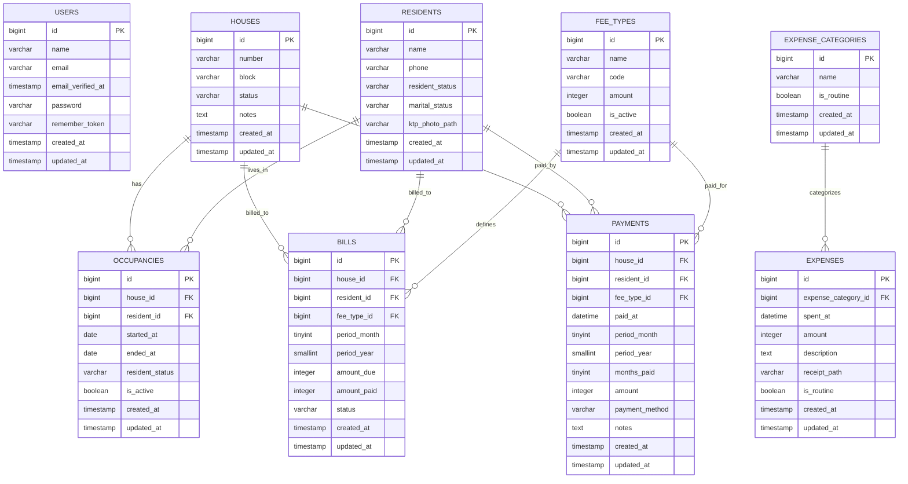

# RT Finance & Resident Management

Aplikasi web untuk administrasi iuran, penghuni, rumah, pembayaran, pengeluaran, dan laporan keuangan RT.

## Getting Started

```bash
# Clone
git clone https://github.com/Xfhreall/beon_fit_be.git
cd beon_fit_be

# Backend setup
composer install
cp .env.example .env
php artisan key:generate
php artisan storage:link

# Frontend setup
npm install

# Database migration & seed
php artisan migrate --seed

# Run dev servers (backend + frontend)
composer run dev
```

Buka `http://localhost:8000` di browser. Login default:

```text
Email    : admin@gmail.com
Password : password
```

## Scope

- Authentication admin RT.
- Dashboard ringkasan rumah, penghuni, pemasukan, pengeluaran, saldo, dan tagihan belum lunas.
- CRUD penghuni dengan upload dan preview foto KTP.
- CRUD rumah, penetapan penghuni aktif, dan riwayat hunian.
- Generate tagihan bulanan untuk rumah yang dihuni.
- Pembayaran iuran satpam dan kebersihan, termasuk pembayaran multi-bulan.
- Pengeluaran rutin dan non-rutin dengan upload dan preview bukti.
- Laporan bulanan dan grafik tahunan.
- Pagination table dengan pilihan 10, 25, 50, atau 100 baris.
- Penyimpanan dan tampilan waktu transaksi memakai jam, menit, detik WIB.

Implementasi saat ini memakai Laravel + Inertia React dalam satu repository. Backend dan frontend tetap dipisahkan secara struktur: kode Laravel di `app/`, `routes/`, `database/`; kode React di `resources/js/`.

## Tech Stack

- PHP 8.3
- Laravel 13
- Laravel Fortify
- Inertia Laravel 3
- React 19
- Tailwind CSS 4
- shadcn/ui
- Recharts
- MySQL
- Pest 4

## Requirements

- PHP 8.3+
- Composer
- Node.js dan npm
- MySQL

## Installation

```bash
composer install
npm install
cp .env.example .env
php artisan key:generate
php artisan storage:link
```

Jalankan migration dan seeder:

```bash
php artisan migrate --seed
```

Seeder membuat:

- 20 rumah awal.
- 15 rumah dihuni.
- 5 rumah kosong.
- Master iuran satpam Rp100.000.
- Master iuran kebersihan Rp15.000.
- Kategori pengeluaran awal.
- Akun admin demo.
- Nomor telepon penghuni demo memakai format `08`.

## Run Locally

Jalankan backend dan frontend dev server:

```bash
composer run dev
```

Alternatif manual:

```bash
php artisan serve
npm run dev
```


## Feature Rules

Billing:

- Rumah dihuni dengan penghuni tetap ditagih setiap bulan.
- Rumah kontrak ditagih selama penghuni aktif.
- Rumah kosong tidak ditagih.
- Tagihan dibuat per rumah, jenis iuran, bulan, dan tahun.
- Pembayaran multi-bulan didukung melalui `months_paid`.

Financial data:

- Pembayaran dan update status tagihan berjalan dalam database transaction.
- Pengeluaran dicatat dengan kategori, nominal, tanggal, dan keterangan.
- Laporan menghitung pemasukan dari pembayaran dan pengeluaran dari transaksi expense.

UI:

- Summary memakai card.
- Detail data memakai table.
- Table memakai pagination dengan pilihan 10, 25, 50, dan 100 baris.
- CRUD memakai dialog atau alert dialog.
- Chart memakai Recharts dengan pola shadcn/ui chart, legend, dan layout responsif.
- Upload gambar menampilkan preview sebelum submit.
- Sidebar mobile otomatis tertutup setelah menu navigasi dipilih.

## ERD



## Verification

```bash
vendor/bin/pint --dirty --format agent
php artisan test --compact
npm run lint:check
npm run types:check
npm run build
```
